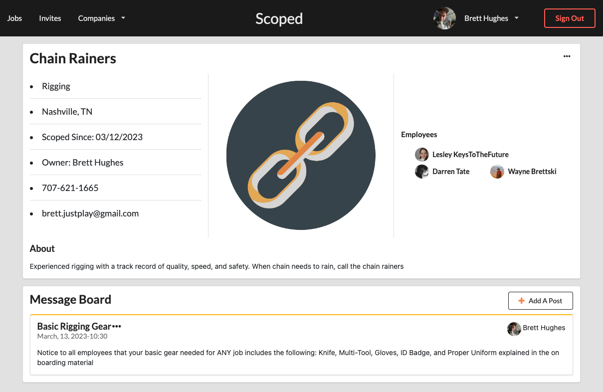
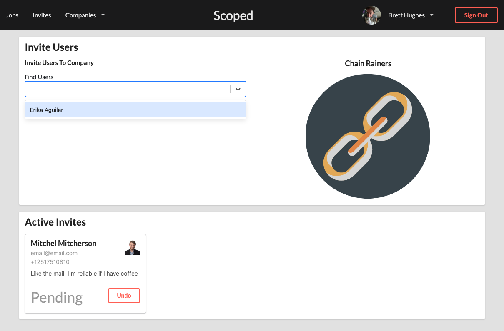
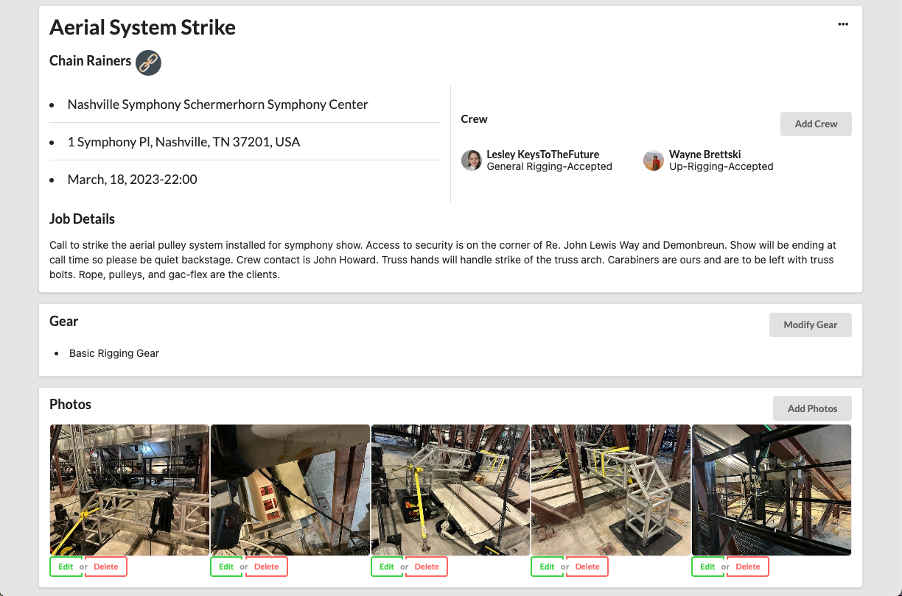
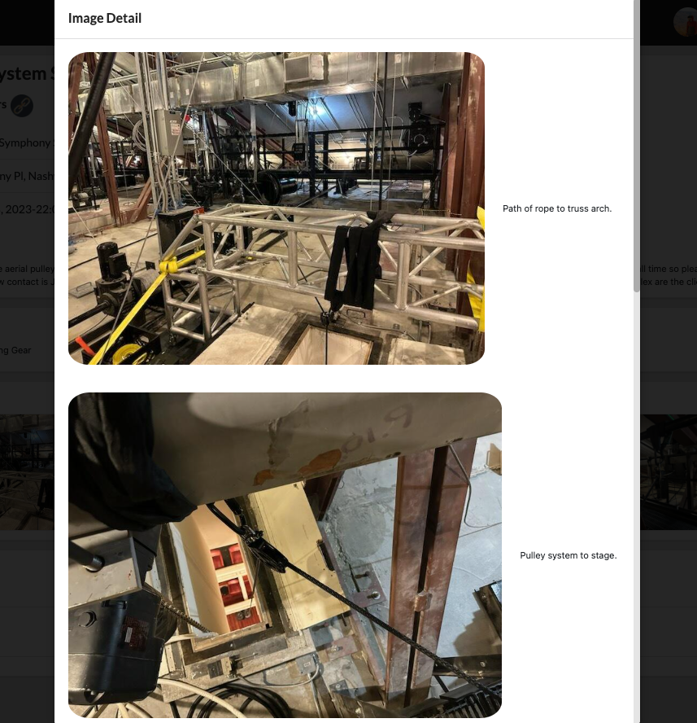
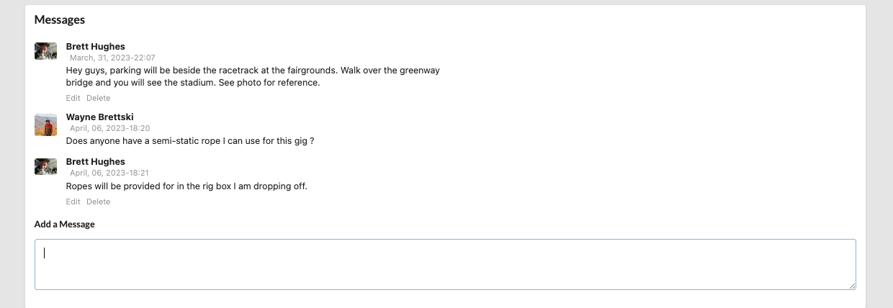

# Welcome to Scoped

Scoped is a Scope of Work application that aims to provide transparency and clear communication from client to skilled laborer.  Inspiration was brought on by past experiences where missing details led to waste of time and money.

## Tech Stack

- React.js with Next.js Framework.
- Python with Django Framework.
- Semantic UI Component Library
- AWS S3 Bucket for Photo Storage
- Google Maps API for City and Establishment Searching

## Features

- Users can create a company

>

- Users can be invited to join a company
 -->
>
- Users can create a jobs and invite employees to accept the work
 -->
>

- Employees can accept or decline the company and job invites
 -->
>

- Images prvide detail to job descriptions
 -->
>

- Comments on the jobs allow discussion to clear up questions
 -->
>

## Usage
<h2>Runing the project locally</h2>

- Clone this repository to your machine
- Create a [firebase](https://firebase.google.com/) project and setup authentication from the Build menu.
- Create a .env file in the root of the cloned repository
- Copy the code block below replacing values with that of you firebase project found in project settings
```
NEXT_PUBLIC_FIREBASE_API_KEY="<YOUR FIREBASE AOI KEY HERE>"
NEXT_PUBLIC_FIREBASE_AUTH_DOMAIN="<YOUR FIREBASE AUTH DOMAIN HERE>"
NEXT_PUBLIC_DATABASE_URL=http://localhost:8000
```
- From the command in the root directory run `npm install` to install project dependencies
- Next run `npm run prepare` to setup husky
- Run `npm run dev` to start the front-end portion of the application

**This repository is dependent on the [Back-End](https://github.com/TwoFivinClimber/Scoped-Server) running as well.  Directions are listed in scoped [Scoped-Server](https://github.com/TwoFivinClimber/Scoped-Server) Readme.
